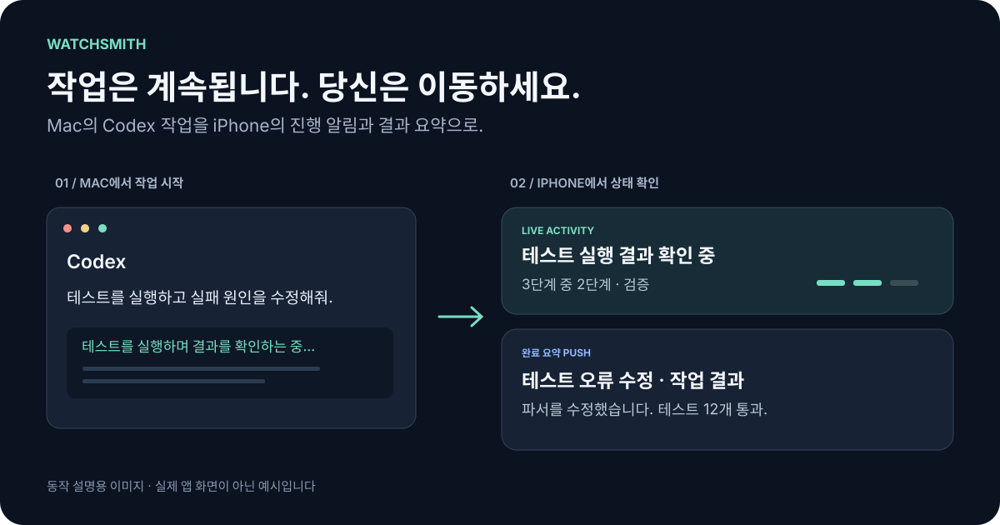
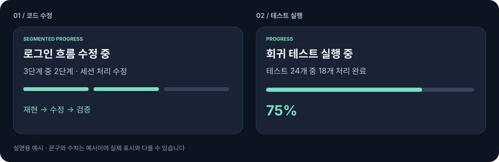
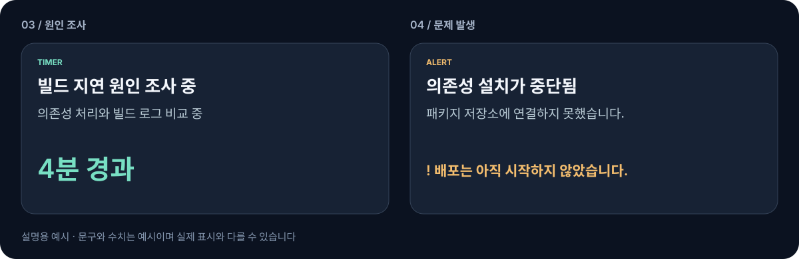
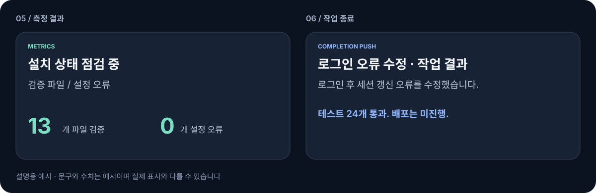
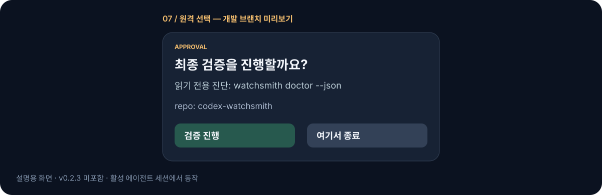
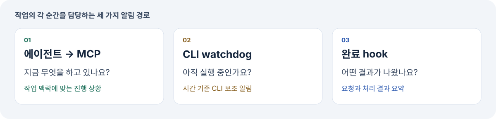

# codex-watchsmith

### Codex가 일하는 동안, 화면 앞에서 기다리지 마세요.

오래 걸리는 작업을 맡겼다면 Mac에서 잠시 벗어나세요. **Watchsmith는 Codex의 진행 상황과 완료 요약을 ActivitySmith를 통해 iPhone으로 전달합니다.** 터미널을 다시 열어 확인하는 대신, 휴대폰에서 작업의 흐름을 확인하세요.

**macOS의 Codex Desktop과 Codex CLI**를 지원합니다. 기존 ActivitySmith 계정과 iOS 앱을 사용합니다.

[English](README.md) · [사용 사례](#이런-작업에-이런-알림을-받습니다) · [시작하기](#시작하기) · [동작 원리](#동작-원리) · [문서 안내](#문서-안내)



---

## “아직 작업 중인가?”를 확인하러 돌아가지 않아도 됩니다

버그 조사, 전체 테스트, 여러 파일에 걸친 수정을 Codex에 맡깁니다. 그리고 같은 창을 계속 들여다봅니다. 아직 실행 중인지, 끝났는지, 확인이 필요한 상황인지 궁금하기 때문입니다.

Watchsmith는 그 상태를 휴대폰으로 가져옵니다.

| Codex에서 일어나는 일 | 휴대폰에서 확인할 내용 |
| --- | --- |
| 에이전트가 작업 단계를 진행합니다 | 의미 있는 진행 상황을 담은 Live Activity |
| 감싼 CLI 작업이 에이전트 알림 없이 길어집니다 | 기본 60초 이후 watchdog의 보조 알림 |
| 응답이 끝납니다 | 요청·결과와 확인 가능한 검증 내용을 담은 요약 Push |
| 이미 다른 알림 연동을 사용 중입니다 | 기존 notifier 연결을 보존하는 설치 방식 |

위 이미지는 실제 앱 화면이 아닌 설명용 예시입니다. 완료 요약은 현재 요청과 답변의 문장을 로컬에서 추출합니다. 응답 종료를 작업 성공으로 단정하지 않습니다.

---

## 이런 작업에 이런 알림을 받습니다

아래는 **실제 스크린샷이 아닌 설명용 예시**입니다. 현실적인 상황을 가정한 문구와 수치이며, 실제 알림에는 에이전트가 확인한 작업·상태·측정값을 사용합니다. 하나의 작업에서 아래 타입을 차례로 바꾸는 것이 아니라 처음 선택한 Live Activity 타입을 유지합니다.

### 버그 수정 단계를 따라가고, 테스트 진행률을 확인하세요

로그인 오류를 재현하고, 세션 처리를 수정하고, 검증하는 흐름을 단계로 확인합니다. 테스트 총개수를 알고 있다면 막연한 추정 대신 **24개 중 18개 처리 완료**처럼 실제 처리량을 표시할 수 있습니다.



### 오래 걸리는 조사는 맡겨 두고, 막힌 이유를 확인하세요

진행률을 알기 어려운 빌드 지연 조사에는 경과 시간을 표시합니다. 패키지 저장소 연결 문제로 설치가 중단됐다면 원인과 함께 배포를 아직 시작하지 않았다는 상태를 안내할 수 있습니다. 이미 진행 카드가 있다면 타입을 유지하면서 상태 문구를 바꿉니다.



### 숫자로 점검하고, 어떤 결과로 끝났는지 확인하세요

설치 점검에서는 검증한 파일 수와 설정 오류 수를 구분해 표시할 수 있습니다. 완료 Push에는 로그인 오류를 어떻게 수정했는지, 테스트가 통과했는지, **배포처럼 아직 수행하지 않은 일이 무엇인지** 함께 담을 수 있습니다.



### 휴대폰에서 다음 작업을 선택하세요

Watchsmith v0.3.0에는 승인 버튼을 바로 보여주는 후속 작업 흐름이 포함돼 있습니다. 진단 요청에서 **검증 진행**을 선택하면 명시된 읽기 전용 명령을 실행하고, **여기서 종료**를 선택하면 실행하지 않습니다. 이미 허용한 작업에 다시 승인을 요구하지 않습니다.



---

## 시작하기

### 1. 먼저 준비해 주세요

| 필요한 항목 | 준비할 내용 |
| --- | --- |
| Mac | macOS, zsh, `python3`로 실행할 수 있는 Python 3.11 이상 |
| Codex | 로그인 후 작업이 가능한 Desktop 또는 CLI. `codex-watch`에는 CLI가 필요합니다 |
| ActivitySmith | 계정과 연결된 iOS 앱, 알림 허용, Live Activities 활성화 |
| API Key | 완료 알림과 CLI watchdog에서 사용할 동일한 ActivitySmith 계정의 키 |
| Node.js / npm | ActivitySmith CLI 설치에 필요합니다. npm이 있으면 설치 도우미가 CLI 설치를 제안할 수 있습니다 |

먼저 [ActivitySmith 공식 시작 안내](https://activitysmith.com/quickstart)를 따라 설정하고, Playground에서 보낸 테스트가 휴대폰에 도착하는지 확인하세요. Watchsmith가 계정 생성, 기기 연결, Python·Codex 설치를 대신하지는 않습니다.

### 2. 설치 도우미를 실행하세요

[최신 릴리즈](https://github.com/GrooshBene/codex-watchsmith/releases/latest)의 패키지를 내려받아 압축을 풀고, 해당 폴더에서 터미널을 열어 실행합니다.

```bash
./setup.sh
```

도우미가 실행 환경을 점검하고, CLI 설정과 API Key 입력을 안내합니다. 기존 설정을 보존하며, 명령 경로 추가와 테스트 Push 전송을 선택할 수 있습니다. API Key는 **macOS Keychain**에 저장됩니다.

패키지 압축 해제 없이 시작하려면 [한 명령 설치 안내](docs/SETUP.md#one-command-entry-point)를 이용하세요. 안정 릴리즈를 내려받아 같은 도우미를 실행합니다. 소스에서 설치하려면 저장소를 복제한 폴더에서 `./setup.sh`를 실행하면 됩니다.

기본 설치 위치는 `~/.codex`입니다. 별도의 `CODEX_HOME`을 사용한다면 설치 전에 지정하고, 업데이트와 제거에도 같은 값을 사용하세요. 기존 설치를 변경하기 전에는 진행 중인 작업을 마치고 관련 앱을 닫으세요.

### 3. 진행 알림을 연결하고 확인하세요

에이전트가 작업 단계를 Live Activity로 알리게 하려면 [ActivitySmith MCP 안내](https://activitysmith.com/integrations/mcp-server)에 따라 Codex에서 연결과 권한 승인을 마치세요. **MCP 승인과 CLI API Key는 별개입니다.** 완료 Push와 CLI watchdog은 MCP 없이도 사용할 수 있습니다.

Codex를 다시 시작하고 새 터미널에서 실행합니다.

```bash
watchsmith doctor
```

작은 Codex 작업을 하나 완료하고 휴대폰에서 완료 Push를 확인하세요. 도우미의 테스트 Push를 건너뛰었다면 `activitysmith-test`를 실행하세요. 로컬 진단은 설치 상태를 확인하며, 실제 휴대폰 수신까지 확인해야 설정 검증이 끝납니다.

건너뛴 설정을 마치려면 `watchsmith setup`을 실행하세요. 세부 절차는 [설치 안내](docs/SETUP.md)에 있습니다.

### 수동 설치

사전 준비를 마친 뒤 내려받은 패키지를 사용하거나 저장소를 복제합니다.

```bash
git clone https://github.com/GrooshBene/codex-watchsmith.git
cd codex-watchsmith
npm i -g activitysmith-cli@latest
./install.sh --check
./install.sh
```

다음 줄을 `~/.zshrc`에 한 번 추가하고 새 터미널을 여세요.

```bash
export PATH="${CODEX_HOME:-$HOME/.codex}/bin:$PATH"
```

키를 등록하고 전송을 확인한 뒤, 위의 MCP 연결과 Codex 재시작을 진행합니다.

```bash
activitysmith-keychain-setup
activitysmith-test
```

기존 설치가 있다면 설정을 지우거나 먼저 제거하지 말고 [업그레이드 안내](docs/UPGRADING.md)를 따르세요.

---

## 평소 작업 방식에 맞춰 사용하세요

**Codex Desktop에서는:** 설치와 재시작 후 평소처럼 작업합니다. 설치된 에이전트 지침이 MCP를 통한 진행 알림을 안내하고, 완료 hook이 응답 종료 알림을 담당합니다.

**오래 걸리는 CLI 작업에는:** 한 번 실행하고 끝나는 명령을 감싸 시간 기준의 보조 알림을 추가합니다.

```bash
codex-watch codex exec "run the full test suite and fix failures"
```

watchdog의 기본 대기 시간은 60초입니다. 감싼 실행 안에서는 에이전트 진행 알림과 watchdog이 같은 스트림 키를 사용해 카드를 조율합니다. CLI가 Live Activity 스트림을 지원하지 않는 경우, MCP 스트림이 존재할 가능성이 없을 때 보조 Push를 사용할 수 있습니다.

Live Activity는 단계, 실제 진행률, 경과 시간, 중요 상태, 측정 수치를 표시할 수 있습니다. 감싼 실행에서는 처음 선택한 타입을 유지하면서 작업 상태 문구를 갱신합니다. 에이전트의 진행 알림은 설치된 지침을 따르는지에 영향을 받습니다.

---

## 동작 원리



세 가지 구성 요소가 작업의 서로 다른 순간을 담당합니다.

| 구성 요소 | 역할 |
| --- | --- |
| ActivitySmith MCP + 에이전트 지침 | 지금 무엇을 하고 있는지 설명합니다 |
| 외부 watchdog | 감싼 CLI 프로세스가 계속 실행 중인지 확인합니다 |
| Codex 완료 hook | 에이전트 턴이 끝나면 결과 요약을 보냅니다 |

긴 도구 호출 중에는 에이전트가 알림을 갱신할 기회를 얻지 못할 수 있습니다. watchdog은 해당 프로세스 밖에서 실행되고, 완료 hook은 별도의 턴 종료 이벤트를 받습니다. [구조 자세히 보기 →](docs/ARCHITECTURE.md)

설치 프로그램은 `CODEX_HOME` 아래에 표시된 지침 블록, 실행 파일, 로컬 복구 상태를 관리합니다. 기존 notifier 인수와 관리 블록 밖의 개인 지침을 보존하며, 인식 가능한 Computer Use 구성에서는 바깥쪽 콜백을 유지합니다. 설정 보존이 외부 콜백의 실제 실행 성공을 보장하지는 않습니다. [호환성과 복구 →](docs/UPGRADING.md)

---

## 다시 설치하지 않고 업데이트하세요

```bash
watchsmith version
watchsmith update --check
```

진행 중인 작업을 마치고 관련 앱을 닫은 뒤 실행합니다.

```bash
watchsmith update --quiesced
```

`--quiesced`는 관련 작업을 중지했다는 사용자 확인입니다. 프로세스를 자동으로 종료하지 않습니다. 업데이트 후 Codex를 다시 시작하세요. 업데이터는 공식 안정 릴리즈, 패키지 검증, 기존 복구 기록을 사용합니다.

가장 최근 설치 작업을 되돌리려면 관련 작업을 중지한 뒤 `watchsmith rollback --quiesced`를 실행하세요. v0.1.0 설치는 [최초 한 번의 수동 이전](docs/UPGRADING.md)이 필요합니다. [업데이트와 검증 자세히 보기 →](docs/UPDATES.md)

---

## 휴대폰으로 공유되는 내용을 확인하세요

- **완료 요약은 선택된 요청·답변 문장을 ActivitySmith에 전달**해 잠금화면에 표시합니다. 추출은 로컬에서 수행하며 별도의 모델을 호출하지 않습니다.
- 코드 블록과 알려진 민감 정보 형태를 제외하지만, 모든 개인정보나 기밀을 탐지하지는 못합니다. 내용 없는 일반 알림을 원하면 **notifier 실행 환경**에 `WATCHSMITH_COMPLETION_PREVIEW=0`을 설정하세요. [설정 방법과 한계](docs/RESULTS.md#automatic-completion-summaries-v023)를 참고하세요.
- API 인증정보는 macOS Keychain에 저장합니다. 복구 기록과 로컬 설치 상태는 Git에 커밋하지 마세요.
- ActivitySmith metadata를 통한 상세 결과 공유는 선택 사항이며 동의가 필요합니다. 전체 대화나 파일을 자동으로 업로드하지 않습니다. [상세 결과 공유 →](docs/RESULTS.md)

---

## 알아둘 동작 범위

- **60초 watchdog은 감싼 일회성 CLI 실행에 적용됩니다.** Desktop을 여는 것만으로 시작되지 않습니다. 계속 열려 있는 대화형 CLI를 감싸면 개별 작업이 아닌 프로세스의 실행 시간을 측정합니다.
- **전송 성공과 기기 표시 확인은 다릅니다.** 알림이 지연되거나 표시되지 않을 수 있습니다. 카드 종료 시 잠금화면에서 즉시 제거를 요청하며, ActivitySmith 앱 내부 기록은 별개입니다.
- **중복 조율에도 범위가 있습니다.** 관리되는 완료 경로는 정확한 이벤트 ID가 있을 때 이를 사용합니다. 독립적인 notifier나 ID 누락 상황은 최선 노력 방식입니다.
- **설치하는 버전을 확인하세요.** 이 문서의 상황별 알림과 완료 제목 필터링은 v0.3.0에 포함됩니다.

---

## 문서 안내

| 하고 싶은 일 | 문서 |
| --- | --- |
| 설치·설정 마무리·Mac 진단 | [설치 안내](docs/SETUP.md) |
| 이전 설치 업그레이드·Computer Use 보존 | [이전과 복구](docs/UPGRADING.md) |
| 릴리즈 업데이트·롤백 | [업데이트](docs/UPDATES.md) |
| 진행 알림과 중복 조율 이해 | [진행 알림](docs/PROGRESS.md) |
| 결과 공유와 개인정보 범위 설정 | [결과 공유](docs/RESULTS.md) |
| 알림 미수신·명령 오류 해결 | [문제 해결](docs/TROUBLESHOOTING.md) |
| 내부 구현 이해 | [아키텍처](docs/ARCHITECTURE.md) |
| 변경사항 기여 | [기여 안내](CONTRIBUTING.md) |

제거하려면 관련 작업을 중지하고 패키지 또는 저장소 폴더에서 `./uninstall.sh --quiesced`를 실행하세요. 관리 지침 블록과 Keychain 항목은 직접 검토하도록 남겨두며, 변경된 notifier의 실행에 필요한 파일은 안전을 위해 보존될 수 있습니다. [제거 자세히 보기](docs/UPGRADING.md#remove-while-preserving-original-hooks)를 참고하세요.

---

## 기여하기

버그 제보와 기여를 환영합니다. Watchsmith 버전, 실행한 명령 또는 작업 흐름, 기대한 결과와 실제 결과를 함께 알려주세요. 인증정보와 비공개 내용은 보고에서 제외해 주세요.

브랜치 규칙과 검증 방법은 [CONTRIBUTING.md](CONTRIBUTING.md)를 참고하세요. 로컬 테스트는 임시 설치와 모의 전송을 사용하며, 실제 휴대폰 수신은 별도로 검증합니다.

---

## 라이선스

[MIT](LICENSE)

완료 제목에서는 Desktop 브라우저 자동 정보와 인식 가능한 확인 응답 블록을 제외하고, 확인 응답만 있으면 현재 답변의 작업 주제를 사용합니다. 29개 상황과 활성 세션의 원격 선택 흐름은 [상황별 알림 안내](docs/MESSAGE_SCENARIOS.md)를 참고하세요.
