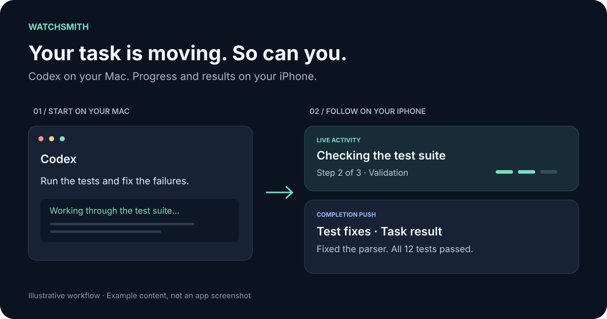
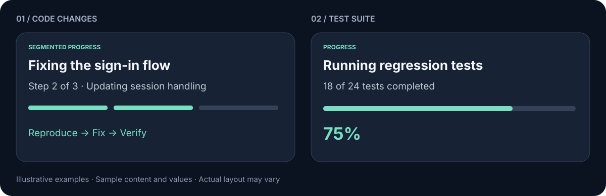
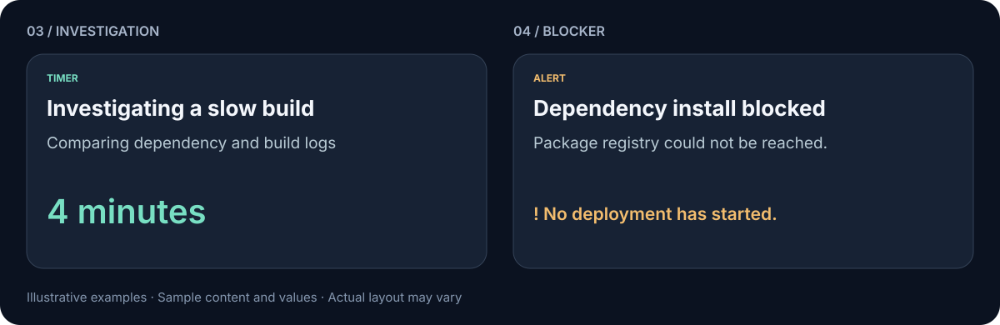
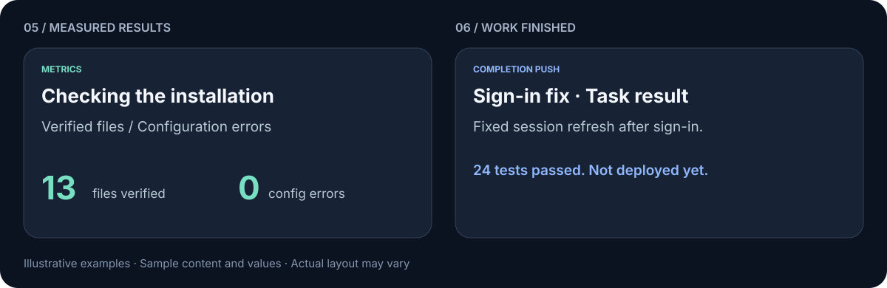
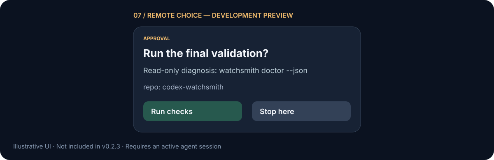
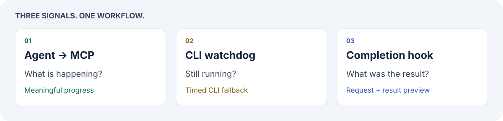

# codex-watchsmith

### Let Codex work. Take the progress with you.

Start a long task, step away from your Mac, and follow its progress on your iPhone. **Watchsmith connects Codex to ActivitySmith for Live Activities and completion summaries**, so you can spend less time checking the terminal.

For **Codex Desktop and Codex CLI on macOS**. Uses your existing ActivitySmith account and iOS app.

[한국어](README.ko.md) · [Use cases](#notifications-for-real-work) · [Get started](#get-started) · [How it works](#how-it-works) · [Documentation](#documentation)



---

## Stop checking whether the agent is done

You ask Codex to investigate a bug, run a test suite, or make a change across several files. Then you keep coming back to the same window: is it still working, has it finished, or does something need attention?

Watchsmith brings those signals to your phone.

| While Codex works… | What you get |
| --- | --- |
| The agent moves through a task | A Live Activity with meaningful progress updates |
| A wrapped CLI job runs long without an agent update | A watchdog fallback after 60 seconds by default |
| A response finishes | A Push with a short request/result preview and available verification |
| You already have a notification integration | An installer that preserves the existing notifier connection |

The illustration shows example content, not an app screenshot. Completion previews use local sentence extraction from the current request and answer. A finished response is not automatically a successful task.

---

## Notifications for real work

These are **illustrative examples, not screenshots**. They show plausible messages and sample measurements; your agent supplies the actual task, status, and available data. A task keeps its initial Live Activity type rather than switching through every layout below.

### Fix a bug. Follow the tests.

Track a sign-in fix through reproduction, implementation, and verification. When test totals are known, a progress card can show **18 of 24 tests completed**, rather than an invented estimate.



### Let an investigation run. Notice a blocker.

For a slow-build investigation with no reliable percentage, elapsed time communicates that work is continuing. An alert can explain a package-registry connection failure and clarify that deployment has not started. For an already active card, the agent keeps its type and updates the status text.



### See the numbers. Understand the result.

An installation check can display verified file and configuration-error counts. A completion Push can describe the sign-in fix, test outcome, and **work still not performed**, such as deployment.



### Choose the next step from your phone

Watchsmith v0.3.0 adds a guided workflow for visible approval buttons. For a requested diagnosis, **Run checks** permits the specified read-only command; **Stop here** leaves it unexecuted. Previously authorized work does not need a new approval.



---

## Get started

### 1. Have these ready

| Requirement | What to prepare |
| --- | --- |
| Mac | macOS, zsh, and Python 3.11+ available as `python3` |
| Codex | A working, signed-in Desktop or CLI installation; CLI is required for `codex-watch` |
| ActivitySmith | An account, the iOS app paired to it, notifications allowed, and Live Activities enabled |
| API key | A key from the same ActivitySmith account, for the completion notifier and CLI watchdog |
| Node.js / npm | Needed to install ActivitySmith CLI; the setup wizard can offer CLI installation when npm is available |

First, follow the [ActivitySmith quickstart](https://activitysmith.com/quickstart) and confirm a Playground test reaches your phone. Watchsmith does not create the account, pair the phone, or install Python/Codex for you.

### 2. Run the setup wizard

Download and extract the package from the [latest release](https://github.com/GrooshBene/codex-watchsmith/releases/latest), open a terminal in that folder, and run:

```bash
./setup.sh
```

The wizard checks your environment, guides CLI setup and API-key entry, preserves existing configuration, and offers to add the command path and send a test Push. Your API key is stored in **macOS Keychain**.

Prefer installing without extracting a package? The [single-command bootstrap](docs/SETUP.md#one-command-entry-point) downloads a stable release and launches the same wizard. For a source checkout, clone this repository and run `./setup.sh` there.

The default installation location is `~/.codex`. If you use a custom `CODEX_HOME`, set it before setup and keep it consistent for updates and removal. Finish active jobs and close affected clients before changing an existing installation.

### 3. Connect progress and verify

For agent-driven Live Activities, follow the [ActivitySmith MCP guide](https://activitysmith.com/integrations/mcp-server) and authorize it in Codex. **MCP authorization and the CLI API key are separate.** Completion Push and the CLI watchdog can work without MCP.

Restart Codex and open a new terminal, then run:

```bash
watchsmith doctor
```

Complete a small Codex task and confirm the completion Push on your phone. If you skipped the wizard's test Push, run `activitysmith-test`. Local diagnostics check installation state; phone receipt is the final check.

Need to finish setup later? Run `watchsmith setup`. See the [setup guide](docs/SETUP.md) for details.

### Manual installation

With the prerequisites ready, use a downloaded package or clone the repository:

```bash
git clone https://github.com/GrooshBene/codex-watchsmith.git
cd codex-watchsmith
npm i -g activitysmith-cli@latest
./install.sh --check
./install.sh
```

Add this line to `~/.zshrc` once, then open a new terminal:

```bash
export PATH="${CODEX_HOME:-$HOME/.codex}/bin:$PATH"
```

Register your key, test delivery, then complete the MCP/restart steps above:

```bash
activitysmith-keychain-setup
activitysmith-test
```

For an existing installation, follow the [upgrade guide](docs/UPGRADING.md) instead of deleting configuration or uninstalling first.

---

## Use it with the way you work

**In Codex Desktop:** work as usual after setup and restart. The installed agent instructions guide meaningful progress updates through MCP; the notify hook handles response completion.

**For a long CLI task:** wrap a one-shot command to add the timed fallback:

```bash
codex-watch codex exec "run the full test suite and fix failures"
```

The watchdog waits 60 seconds by default. Within a wrapped run, agent progress and watchdog fallback share a stream key to coordinate the card. When the CLI does not support Live Activity streams, a fallback Push is available when no MCP stream may already exist.

Live Activities can show steps, measured progress, elapsed time, alerts, or measured statistics. The initial type stays consistent through a wrapped run; status text can change as the work advances. Agent-driven updates depend on the agent following the installed policy.

---

## How it works



Three small parts cover different moments in a task:

| Part | Responsibility |
| --- | --- |
| ActivitySmith MCP + agent instructions | Describe what the agent is doing |
| External watchdog | Notice that a wrapped CLI process is still running |
| Codex completion hook | Send a result preview when the agent turn ends |

A long tool call can keep the agent busy without a chance to send an update. The watchdog runs outside that process. The completion hook gets its own end-of-turn event. [Architecture details →](docs/ARCHITECTURE.md)

The installer maintains a marked policy block, runtime helpers, and local recovery state under `CODEX_HOME`. It preserves existing notifier arguments and personal instructions outside that block. Recognized Computer Use setups retain their outer callback. Configuration preservation does not certify that an external callback executes successfully. [Compatibility and recovery →](docs/UPGRADING.md)

---

## Update without reinstalling from scratch

```bash
watchsmith version
watchsmith update --check
```

After finishing active jobs and closing affected clients:

```bash
watchsmith update --quiesced
```

`--quiesced` confirms that you have stopped affected work; it does not stop processes for you. Restart Codex after updating. The updater uses official stable releases, package verification, and the existing recovery journal.

To undo the latest installation transaction, stop affected work and run `watchsmith rollback --quiesced`. Older v0.1.0 installations need a [one-time manual migration](docs/UPGRADING.md). [Update and verification details →](docs/UPDATES.md)

---

## Know what reaches your phone

- **Completion previews share selected request and answer text with ActivitySmith** for display on the Lock Screen. Extraction is local; no extra model call is made.
- Fenced code and common sensitive patterns are filtered. This does not detect every private or confidential detail. For neutral notifications, set `WATCHSMITH_COMPLETION_PREVIEW=0` in the **notifier's environment**; see [configuration and limits](docs/RESULTS.md#automatic-completion-summaries-v023).
- API credentials stay in macOS Keychain. Keep recovery journals and local installation state out of Git.
- Richer result details in ActivitySmith metadata are optional and require authorization. Full transcripts and files are not automatically uploaded. [Detailed results →](docs/RESULTS.md)

---

## What to expect

- **The 60-second watchdog covers wrapped one-shot CLI processes.** Opening Desktop does not start it. An always-open interactive CLI session measures process lifetime, not individual tasks.
- **A successful send is not a device display receipt.** Delivery can be delayed or missing. Ending a card requests immediate Lock Screen removal; ActivitySmith app history remains separate.
- **Duplicate coordination has boundaries.** Owned completion paths use exact event IDs when available. Independent notifiers and missing IDs remain best effort.
- **Check which version you are installing.** The notification scenarios and completion-title filtering described here are included in v0.3.0.

---

## Documentation

| I want to… | Read |
| --- | --- |
| Install, finish setup, or diagnose my Mac | [Setup](docs/SETUP.md) |
| Migrate an older install or preserve Computer Use | [Upgrade and recovery](docs/UPGRADING.md) |
| Update or roll back a release | [Updates](docs/UPDATES.md) |
| Understand progress and duplicate coordination | [Progress](docs/PROGRESS.md) |
| Control result sharing and privacy | [Results](docs/RESULTS.md) |
| Fix missing notifications or command errors | [Troubleshooting](docs/TROUBLESHOOTING.md) |
| Understand the implementation | [Architecture](docs/ARCHITECTURE.md) |
| Contribute a change | [Contributing](CONTRIBUTING.md) |

To uninstall, stop affected jobs and run `./uninstall.sh --quiesced` from a package or checkout. The managed instruction block and Keychain entry remain for manual review; changed notifier dependencies may be retained for safety. See [removal details](docs/UPGRADING.md#remove-while-preserving-original-hooks).

---

## Contributing

Bug reports and contributions are welcome. Include the Watchsmith version, the command or workflow, and what you expected versus what happened. Remove credentials and private content from reports.

See [CONTRIBUTING.md](CONTRIBUTING.md) for branch conventions and validation. Local tests use temporary installations and mocked transports; actual phone delivery is verified separately.

---

## License

[MIT](LICENSE)

Completion titles exclude Desktop browser-context blocks and recognized question-response envelopes. Confirmation-only inputs use the current answer topic. See [notification scenarios](docs/MESSAGE_SCENARIOS.md) for the 29 supported situations and active-session approval workflow.
